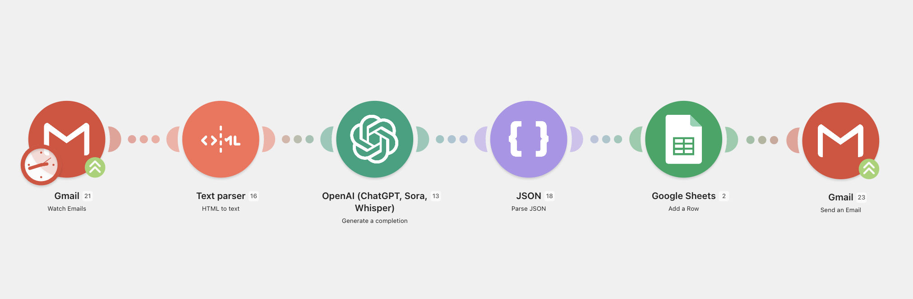

# AI Hiring Lead Processing

An AI-powered recruitment workflow built in Make that automatically processes incoming job applications, extracts structured candidate information using GPT, stores it in Google Sheets, and prepares the data for downstream hiring automations.

## Overview

Recruiters often spend valuable time manually reading emails, extracting candidate information, and updating spreadsheets before they can even start communicating with applicants.

This workflow automates the entire intake process.

When a new application arrives, the workflow:

1. Monitors a dedicated Gmail inbox
2. Extracts the email content from HTML
3. Uses OpenAI to identify and structure candidate information
4. Parses the AI response into JSON
5. Saves the structured data into Google Sheets
6. Makes the data available for follow-up automations (such as automated email responses)

---

## Workflow



---

## Technologies

- Make
- OpenAI GPT
- Gmail
- Google Sheets
- JSON
- AI Prompt Engineering

---

## Features

- Automatic monitoring of incoming applications
- AI extraction of candidate information
- Structured JSON output
- Automatic Google Sheets logging
- Ready for downstream recruitment automations
- Fully no-code implementation

---

## Example Flow

Incoming Email

↓

HTML → Plain Text

↓

OpenAI extracts:

- Name
- Email
- Phone Number
- Position
- City
- Availability
- Additional Information

↓

Structured JSON

↓

Google Sheets Database

↓

Ready for Email Automation

---

## Project Structure

```
Gmail
    ↓
Text Parser
    ↓
OpenAI
    ↓
JSON Parser
    ↓
Google Sheets
    ↓
Gmail
```

---

## Related Project

This repository is part of the **AI Hiring Automation** project series.

➡️ **ai-hiring-email-automation**

The email automation workflow consumes the structured candidate data generated by this project and automatically creates personalized recruitment responses.

---

## Purpose

This project demonstrates how AI can eliminate repetitive manual work in recruitment by automatically transforming unstructured emails into clean, structured candidate data.

It serves as the first step in a fully automated AI recruitment pipeline.

---
